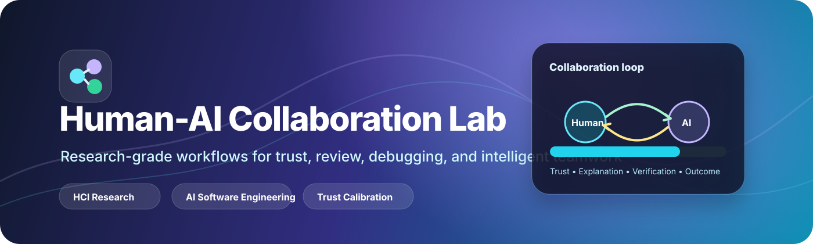
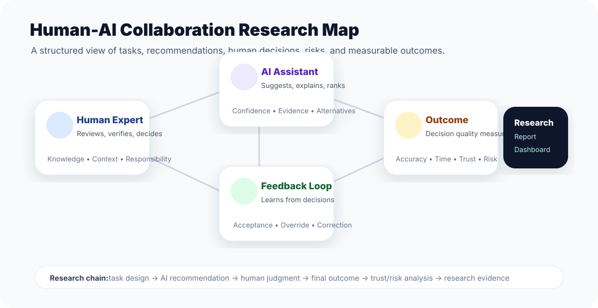
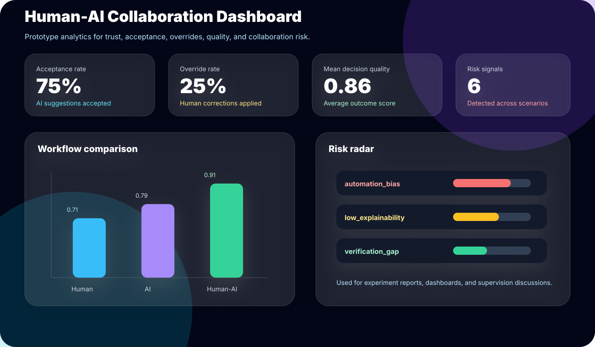
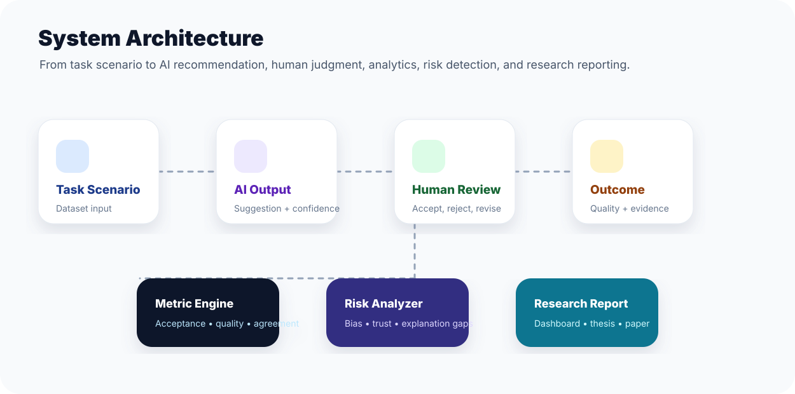
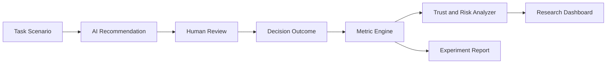

<p align="center">
  
</p>

<h1 align="center">Human-AI Collaboration Lab</h1>

<p align="center">
  <b>A research-grade laboratory for studying how humans and AI systems collaborate in software engineering, decision support, debugging, review, and knowledge work.</b>
</p>

<p align="center">
  
  
  
  
  
</p>

---

## Overview

**Human-AI Collaboration Lab** is an academic software engineering research project focused on the design, evaluation, and governance of AI-assisted work. The repository treats human-AI collaboration as a measurable system involving **people, tasks, AI recommendations, trust, feedback loops, cognitive load, collaboration quality, and final outcomes**.

The project is especially useful for PhD-level research in:

- Human-computer interaction and human-centered AI.
- AI-assisted software engineering.
- Collaborative debugging and code review.
- Trust calibration and explainable recommendations.
- Developer productivity, workload, and decision quality.
- Empirical software engineering experiment design.

<p align="center">
  
</p>

---

## Why this project matters

Modern AI tools can write code, review changes, summarize issues, generate tests, and suggest fixes. The key research question is no longer only **Can AI produce a useful suggestion?** A stronger PhD-level question is:

> **How do humans and AI systems coordinate, negotiate uncertainty, share responsibility, and improve outcomes together?**

This repository explores that question through a structured research prototype. It provides a foundation for modeling collaboration workflows, evaluating AI assistance quality, and studying the interaction between human expertise and machine-generated recommendations.

---

## Research Questions

This project is designed around research questions such as:

| Area | Example research question |
|---|---|
| Trust calibration | When do developers over-trust or under-trust AI recommendations? |
| Collaborative debugging | Does AI support reduce debugging time without reducing understanding? |
| Review quality | Can human-AI review workflows detect defects better than human-only review? |
| Cognitive load | Does AI assistance reduce workload or simply shift it to verification? |
| Explainability | Which explanation format helps developers accept, reject, or revise AI output? |
| Team workflow | How should AI suggestions be shared inside collaborative development teams? |
| Governance | How can AI-assisted decisions remain auditable and accountable? |

---

## Core Features

### 1. Collaboration Scenario Modeling

The repository includes reusable scenario templates for modeling AI-assisted tasks. A scenario can describe:

- The human role.
- The AI role.
- The task context.
- The AI recommendation.
- The human decision.
- The final outcome.
- The feedback signal.
- Collaboration risks.

### 2. Human-AI Workflow Evaluation

The evaluation toolkit is designed to compare human-only, AI-only, and human-AI workflows.

| Workflow | Description | Example output |
|---|---|---|
| Human-only | Expert completes task without AI support | Baseline quality and time |
| AI-only | AI generates recommendation independently | Automation quality |
| Human-AI | Human uses AI suggestion with verification | Collaboration quality |

### 3. Collaboration Quality Metrics

The prototype includes simple metrics for:

- Recommendation acceptance rate.
- Human override rate.
- Agreement rate.
- Human-AI complementarity.
- Decision accuracy.
- Review efficiency.
- Trust calibration signals.

### 4. Trust and Risk Analysis

Human-AI systems can fail when trust is misaligned. The risk module highlights collaboration issues such as:

- Blind acceptance.
- Excessive rejection.
- Automation bias.
- Over-reliance on low-confidence suggestions.
- Lack of explanation.
- Poor feedback collection.
- Unclear accountability.

### 5. Research Dashboard Concept

The repository includes a dashboard concept for presenting collaboration experiment results, participant workflow metrics, and AI recommendation behavior.

<p align="center">
  
</p>

---

## System Architecture

<p align="center">
  
</p>



---

## Repository Structure

```text
human_ai_collaboration/
├── README.md
├── LICENSE
├── CITATION.cff
├── CONTRIBUTING.md
├── SECURITY.md
├── requirements.txt
├── assets/
│   ├── banner.svg
│   ├── collaboration-map.svg
│   ├── dashboard-preview.svg
│   └── system-architecture.svg
├── data/
│   └── collaboration_scenarios.json
├── docs/
│   ├── architecture.md
│   ├── evaluation-methodology.md
│   └── roadmap.md
├── examples/
│   └── evaluate_collaboration.py
├── src/
│   └── hai_lab/
│       ├── __init__.py
│       ├── metrics.py
│       ├── risk.py
│       └── workflow.py
├── tests/
│   └── test_metrics.py
└── .github/
    └── workflows/
        └── python-check.yml
```

---

## Quick Start

### 1. Clone the repository

```bash
git clone https://github.com/Hirakhyzer/human_ai_collaboration.git
cd human_ai_collaboration
```

### 2. Create a Python environment

```bash
python -m venv .venv
source .venv/bin/activate  # Windows: .venv\Scripts\activate
```

### 3. Install dependencies

```bash
pip install -r requirements.txt
```

### 4. Run the demo evaluation

```bash
python examples/evaluate_collaboration.py
```

### 5. Run tests

```bash
pytest
```

---

## Example Output

The demo reads sample collaboration scenarios and prints a compact research summary:

```json
{
  "scenario_count": 4,
  "acceptance_rate": 0.75,
  "override_rate": 0.25,
  "agreement_rate": 0.75,
  "mean_decision_quality": 0.86,
  "dominant_risks": [
    "automation_bias",
    "low_explainability"
  ]
}
```

---

## Sample Collaboration Scenario

```json
{
  "id": "debugging_001",
  "task": "Locate a regression bug in a data processing pipeline",
  "human_role": "software developer",
  "ai_role": "debugging assistant",
  "ai_recommendation": "Inspect the recent schema validation change",
  "human_decision": "accepted",
  "outcome_quality": 0.92,
  "ai_confidence": 0.81,
  "explanation_quality": 0.76,
  "risk_tags": ["automation_bias"]
}
```

---

## Metrics Used in the Prototype

| Metric | Meaning |
|---|---|
| Acceptance rate | Share of AI recommendations accepted by the human |
| Override rate | Share of AI recommendations rejected or corrected |
| Agreement rate | Share of cases where human decision aligns with AI suggestion |
| Mean decision quality | Average outcome quality score across scenarios |
| Complementarity signal | Whether human-AI outcomes improve over AI-only or human-only baselines |
| Risk frequency | Count of repeated collaboration risks across scenarios |

---

## Academic Use Cases

### For PhD Students

- Frame a thesis topic around human-centered AI in software engineering.
- Build an empirical study comparing human-only and human-AI workflows.
- Design measurable constructs for trust, acceptance, and decision quality.
- Create structured experiment materials and pilot datasets.

### For Software Engineering Researchers

- Model AI-assisted debugging, review, and test generation workflows.
- Evaluate developer acceptance of AI recommendations.
- Study how explanation quality affects human decisions.
- Analyze collaboration failure modes.

### For HCI Researchers

- Study interaction design for AI-assisted decision making.
- Compare explanation styles and confidence displays.
- Investigate cognitive load and user trust.
- Build evaluation protocols for responsible AI interfaces.

---

## Evaluation Methodology

The suggested research workflow is:

1. Define a task scenario.
2. Collect human-only baseline performance.
3. Collect AI-only recommendation output.
4. Run a human-AI assisted condition.
5. Measure accuracy, time, confidence, trust, and perceived workload.
6. Compare decision quality and collaboration risks.
7. Report where AI improved, harmed, or failed to change outcomes.

---

## Research Design Principles

Human-AI Collaboration Lab follows five design principles:

1. **Human agency** — AI should assist rather than silently replace human judgment.
2. **Transparency** — recommendations should include confidence, evidence, or explanation.
3. **Auditability** — decisions should be traceable from task to recommendation to outcome.
4. **Complementarity** — collaboration should be evaluated against human-only and AI-only baselines.
5. **Responsible use** — collaboration metrics should include risk, trust, and accountability.

---

## Roadmap

### Phase 1 — Research Prototype

- [x] Professional README and project identity
- [x] Visual assets and architecture diagrams
- [x] Sample collaboration dataset
- [x] Metric engine
- [x] Risk analyzer
- [x] Demo evaluation script
- [x] Unit tests
- [x] GitHub Actions CI

### Phase 2 — Empirical Study Toolkit

- [ ] Participant study templates
- [ ] Human-only vs AI-assisted experiment runner
- [ ] Survey instruments for trust and workload
- [ ] CSV export for statistical analysis
- [ ] Scenario authoring guide

### Phase 3 — Developer Workflow Integration

- [ ] GitHub issue review scenario templates
- [ ] Pull request review simulation
- [ ] Debugging task timeline model
- [ ] AI recommendation logging format
- [ ] Explanation quality rubric

### Phase 4 — Advanced Human-AI Analytics

- [ ] Trust calibration curves
- [ ] Human override pattern detection
- [ ] Team-level collaboration analytics
- [ ] Longitudinal learning effects
- [ ] Research dashboard implementation

---

## Ethical and Responsible AI Statement

This repository is intended for research and educational use. It should not be used to claim that AI improves human work without empirical validation. Human-AI collaboration systems should be evaluated for accuracy, bias, over-reliance, explainability, accessibility, accountability, and user autonomy.

---

## Contributing

Contributions are welcome. Useful contributions include:

- New collaboration scenarios.
- Better trust and risk metrics.
- Evaluation protocols for developer studies.
- Visualization modules.
- Experiment templates.
- Tests and documentation improvements.

Please open an issue before major changes so the research direction can remain clear.

---

## License

This project is released under the MIT License.

---

## Author

Created by **Hira Khyzer** as a research-focused academic software project on human-AI collaboration.

<p align="center">
  <b>Human-AI Collaboration Lab — studying the future of people and intelligent systems working together.</b>
</p>
