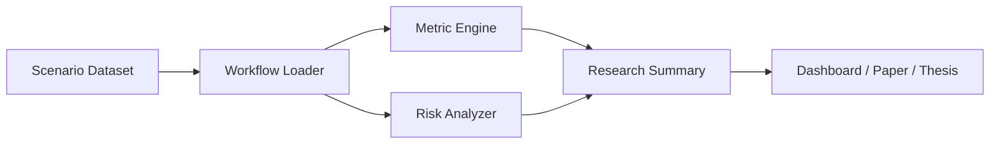

# Architecture

Human-AI Collaboration Lab is organized around a simple research pipeline: scenario definition, AI recommendation, human decision, outcome measurement, and risk analysis.

## Components

### 1. Scenario dataset

The dataset stores structured cases for AI-assisted work. Each scenario records the human role, AI role, AI recommendation, human decision, outcome quality, explanation quality, confidence, and risk tags.

### 2. Workflow utilities

The workflow module loads and validates collaboration scenarios. It also converts scenarios into compact tables suitable for reports and notebooks.

### 3. Metric engine

The metric engine computes summary indicators such as acceptance rate, override rate, agreement rate, mean decision quality, and mean explanation quality.

### 4. Risk analyzer

The risk analyzer counts repeated collaboration risks and highlights simple trust-calibration warning signs.

### 5. Research reporting layer

The reporting layer is represented by the example script and the visual dashboard concept. Future versions can export CSV, Markdown, PDF, or dashboard-ready JSON.

## Mermaid architecture

## Design principle

The system is intentionally transparent. Every metric can be traced back to scenario-level records, which makes the project suitable for academic research, replication, and supervision discussions.
